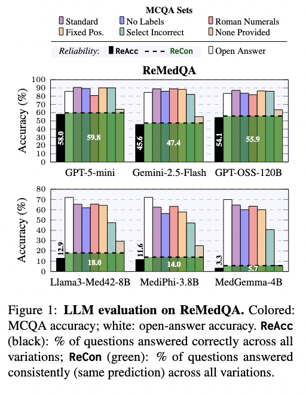
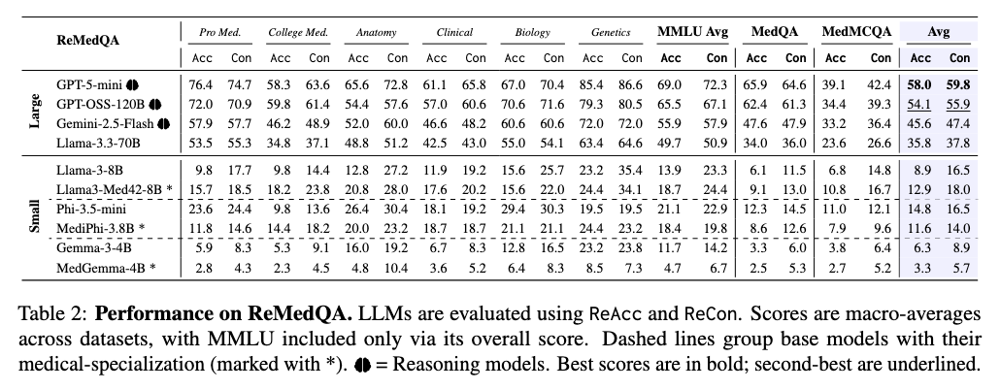
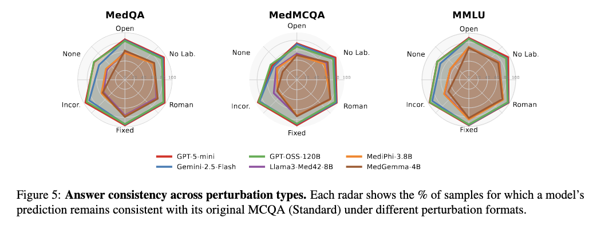

# ReMedQA

This repository contains the dataset and code for our paper: **"ReMedQA: Are We Done With Medical Multiple-Choice Benchmarks?"**

Medical MCQA benchmarks report near-human accuracy, but accuracy alone is not a reliable measure of competence. Models often change their answers under minor perturbations, revealing a lack of robustness. **ReMedQA** addresses this gap by augmenting standard medical MCQA datasets with **open-answer variants** and **systematically perturbed items**, enabling fine-grained evaluation of model reliability.

We also introduce two new metrics:  
- 🧠 **ReAcc** – measures correctness across all variations  
- 🔁 **ReCon** – measures consistency regardless of correctness

Our findings show that high accuracy can mask low reliability. Large models often exploit structural cues, while smaller models are underestimated by standard MCQA. Despite near-saturated accuracy, we are **not** yet done with medical multiple-choice benchmarks.

---

## ⚙️ Installation

```bash
git clone https://github.com/your-username/remedqa.git
cd remedqa
pip install -r requirements.txt
```

---

## Data

To construct ReMedQA, we draw from three widely used medical corpora, resulting in eight English-language MCQA tasks covering domains such as clinical reasoning, genetics, and anatomy.
These datasets mirror both real-world medical scenarios and exam formats used in professional licensing and entrance tests.

To reproduce the creation of our dataset please see [Data Preprocessing Pipeline](#data-preprocessing-pipeline).

A summary of key statistics is shown below:

| **Dataset**             | **MedQA** | **MedMCQA** | **Clinical** | **Genetics** | **Anatomy** | **Pro Med.** | **Biology** | **College Med.** |
| ----------------------- | --------- | ----------- | ------------ | ------------ | ----------- | ------------ | ----------- | ---------------- |
| **Answer Options**      | A/B/C/D   | A/B/C/D     | A/B/C/D      | A/B/C/D      | A/B/C/D     | A/B/C/D      | A/B/C/D     | A/B/C/D          |
| **Avg. Question Words** | 118.2     | 14.1        | 11.1         | 12.3         | 13.7        | 105.5        | 22.4        | 48.8             |
| **Test Size (orig.)**   | 1,273     | 4,183       | 265          | 100          | 135         | 272          | 144         | 173              |
| **After Filtering**     | 1,259     | 1,000       | 193          | 82           | 125         | 254          | 109         | 132              |


All datasets used in our experiments are available in the [`data/`](data/) directory.

---

### Raw Data

* `data/benchmark.json` — original multiple-choice (closed-form) questions for each subset.
* `data/benchmark_open.json` — open-ended reformulations of the same questions generated with **GPT-4.1**.

  * If a conversion is not feasible, the `open_question` field is set to `"Not possible"` along with an explanatory note.
  * This allows transparent inspection of which questions could not be reliably converted and why.


---

### Processed Data

The folder [`data/processed/`](data/processed/) contains the **final filtered datasets** used for evaluation.

* Filtering removes samples that could not be consistently converted into open-ended format.
* For **MedMCQA**, we further perform **stratified subsampling to 1,000 items** to ensure balanced evaluation across subjects.

---


### Prompt Templates

Prompt templates used during all experiments are stored in [`data/templates/`](data/templates/):

* `templates.json` — templates for **non-reasoning models**.
* `templates_think.json` — templates for **reasoning models**.
* `options_only_templates_think.json` — templates for reasoning models in **“options only”** mode (i.e., question text removed).

> 💡 *Reasoning models* are LLMs that produce an explicit reasoning trace before giving their final answer, often enclosed in tags such as `<thinking>...</thinking>`.
> Examples include **Gemini 2.5 Flash** and **GPT-5-mini**.

---

### Data Ready for Inference

The folder [`data/bench/`](data/bench/) provides **model-ready prompts** for each medical subset, supporting multiple modes: MCQ (standard multiple-choice), Open (open-ended questions), None of the provided, Fixed position, etc.

For details on how to generate these input prompts for each mode, please refer to the [Creating Input Prompts](#creating-input-prompts) section.

> When a file name includes the suffix `_think`, the prompt is specifically designed for **reasoning models**.

---


## Quick Start

### Environment Setup

Before running any scripts, create a `.env` file in the root directory to store your API credentials.

```bash
# .env
GEMINI_API_KEY=<your_gemini_api_key>
HUGGINGFACE_TOKEN=<your_huggingface_token>
TOGETHER_API_KEY=<your_together_api_key>
OPENAI_API_KEY=<your_openai_api_key>
```

These keys are required for accessing different model APIs.

## 1. Run Evaluation

### Evaluating Open-Source Models (via vLLM)
```bash
MODEL_TYPE="mediphi"
SEED=42
BATCH_SIZE=8
MAX_NEW_TOKENS=2000
MODE="fixed_pos no_symbols none_of_the_provided" # select your modes

# ---- Loop over subsets ----
for SUBSET in medqa medmcqa mmlu; do

  if [ "$SUBSET" = "medqa" ]; then
    DATASET_PATH="data/bench/medqa_all.json"
  elif [ "$SUBSET" = "mmlu" ]; then
    DATASET_PATH="data/bench/mmlu_all.json"
  elif [ "$SUBSET" = "medmcqa" ]; then
    DATASET_PATH="data/bench/medmcqa_all.json"
  fi
  
  echo "Running for subset: $SUBSET"
  
  CMD="python3 -m src.bench_vllm \
    --model-type $MODEL_TYPE \
    --seed $SEED \
    --batch-size $BATCH_SIZE \
    --max-new-tokens $MAX_NEW_TOKENS \
    --dataset-path $DATASET_PATH \
    --subset $SUBSET \
    --modes $MODE"

  echo "Executing: $CMD"
  eval $CMD
  echo "-------------------------------------"
done
```

### Evaluating API Models (OpenAI, Gemini, TogetherAI)

```bash
# example gemini 
SUBSET="mmlu"
MODEL_NAME="gemini-2.5-flash" #"gemini-2.5-flash" #"gpt-5-mini" #"openai/gpt-oss-120b" "meta-llama/Llama-3.3-70B-Instruct-Turbo" 
OUTPUT_DIR="out/completions"
OPTIONS_ONLY_MODE=false

echo "Evaluating API Models..."
python3 -m src.bench_api_models \
    --output-dir "$OUTPUT_DIR" \
    --subset "$SUBSET" \
    --model-name "$MODEL_NAME" \
    $(if $OPTIONS_ONLY_MODE; then echo "--options-only-mode"; fi)  
```

### Retrieving API Results

```bash
JOB_NAME="<your_batch_id>" 
OUTPUT_DIR="<your_output_dir>"
OPTIONS_ONLY_MODE=true
DATASET_DIR="data/bench"

echo "Retrieving API results and saving in: $OUTPUT_DIR"
python3 -m src.get_api_results \
    --job-name "$JOB_NAME" \
    -o "$OUTPUT_DIR" \
    --dataset-dir "$DATASET_DIR" \
    $(if $OPTIONS_ONLY_MODE; then echo "--options-only-mode"; fi)  
```

## 2. Mapping Open-Ended Answers via LLM Judge
To map open-ended answers back to the original multiple-choice options:

```bash
# example on MedQA
python3 src/llm_judge.py --subset medqa --completion_dir out/completions/mediphi
```

### Convert Judge Predicitions
To convert the final judge predictions for a dataset (e.g., MedQA):

```bash
python3 -m src.utils.convert_judge_preds \
  --subset "medqa" \
  --model_name "together_api/openai/gpt-oss-120b" \
  --input_path "<your_input_dir>/judges_medqa.jsonl"
```

## 3. Computing Evaluation Scores
Calculate ReAcc and ReCon scores:

```bash
MODEL_NAME="together_api/openai/gpt-oss-120b" #"openai_api/gpt-5-mini" #"together_api/openai/gpt-oss-120b" "llama3" "gemini_api/gemini-2.5-flash" #"together_api/meta-llama/Llama-3.3-70B-Instruct-Turbo"  "gemma3" "medgemma" "llama3" "Llama3-Med42-8B" "mediphi" "Phi-3.5-mini"
OPTIONS_ONLY_MODE=false

echo "Evaluating API Models..."
python3 -m src.bench_api_models \
    --output-dir "$OUTPUT_DIR" \
    --subset "$SUBSET" \
    --model-name "$MODEL_NAME" \
    $(if $OPTIONS_ONLY_MODE; then echo "--options-only-mode"; fi)  
```

---

## Creating Input Prompts
Generate input prompts for each data mode:

```bash
OPTIONS_ONLY_MODE=false
INPUT="data/processed/benchmark_closed_filtered.json"
THINK_MODE=false

if $OPTIONS_ONLY_MODE; then
    echo "Creating options-only mode datasets..."


    for subset in "medqa" "medmcqa" "mmlu"; do
        OUTPUT="data/def/${subset}_options_only.json"
        TEMPLATE="data/templates/options_only_templates_think.json"
        echo "Creating data modes for subset: $subset"
        python3 -m src.utils.create_data_modes \
            -i "$INPUT" \
            -o "$OUTPUT" \
            --subset "$subset" \
            --options-only-mode \
            --template "$TEMPLATE"
    done

else
    OPEN_FILE="data/processed/benchmark_open_filtered.json"

    for subset in "medqa" "medmcqa" "mmlu"; do
        if $THINK_MODE; then
            OUTPUT="data/def/${subset}_all_think.json"
            TEMPLATE="data/templates/templates_think.json"
        else
            OUTPUT="data/def/${subset}_all.json"
            TEMPLATE="data/templates/templates.json"
        fi
        
        echo "Creating data modes for subset: $subset"
        python3 -m src.utils.create_data_modes \
            -i "$INPUT" \
            -o "$OUTPUT" \
            --subset "$subset" \
            --open-file "$OPEN_FILE" \
            --template "$TEMPLATE"
    done
fi
```

## Data Preprocessing Pipeline

To reproduce the open-ended dataset creation process:

```bash
# 1. Convert each MCQA subset (MedQA, MedMCQA, MMLU) into open-ended format using GPT-4.1
python3 process_data/convert_mcqa_open_api.py

# 2. Parse the raw OpenAI API responses into structured JSON
python3 process_data/parse_mcqa_open_api.py

# 3. Save the parsed outputs for each subset separately
python3 process_data/save_bench_open.py

# 4. Merge all open-ended subsets into a single benchmark
python3 process_data/combine_bench_open.py

# 5. Subsample MedMCQA to 1K 
python3 process_data/filter_medmcqa.py

# 6. Generate the final versions of both open-ended and original MCQA datasets
python3 process_data/process_dataset.py
```

> *Note: Check the input parameters within each script to adapt to your specific needs.*

---

## Results

### Overall Perfomance
The Figure below shows model performance on ReMedQA, comparing open-ended responses with all MCQA perturbation variants and reporting the averaged reliability metrics (**ReAcc** and **ReCon**) across datasets.

<p align="center">
  
</p>

### Dataset-Specific Reliability

The Table below breaks down **ReAcc** and **ReCon** across the datasets in ReMedQA, revealing large reliability gaps across them.

<p align="center">
  
</p>

### Consistency under Perturbations
The Figure below analyzes reliability across perturbation types, showing the percentage of samples for which a model preserves the same prediction as in the standard MCQA setting.

<p align="center">
  
</p>